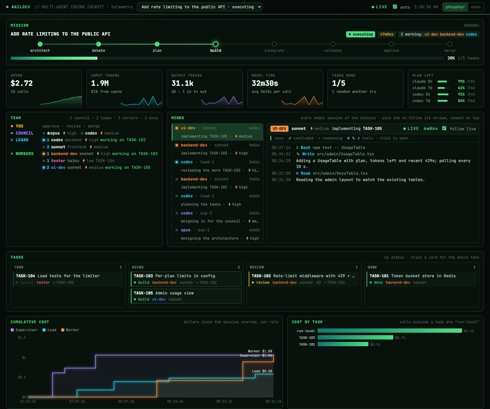
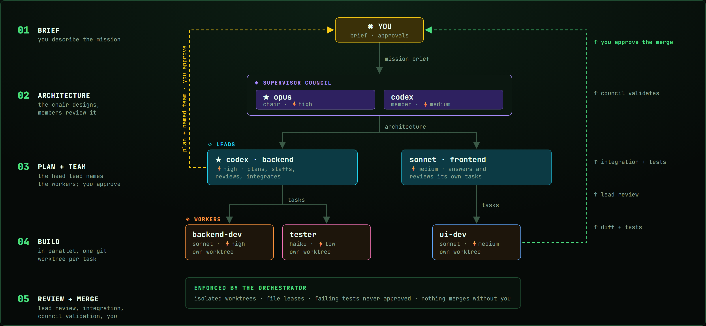
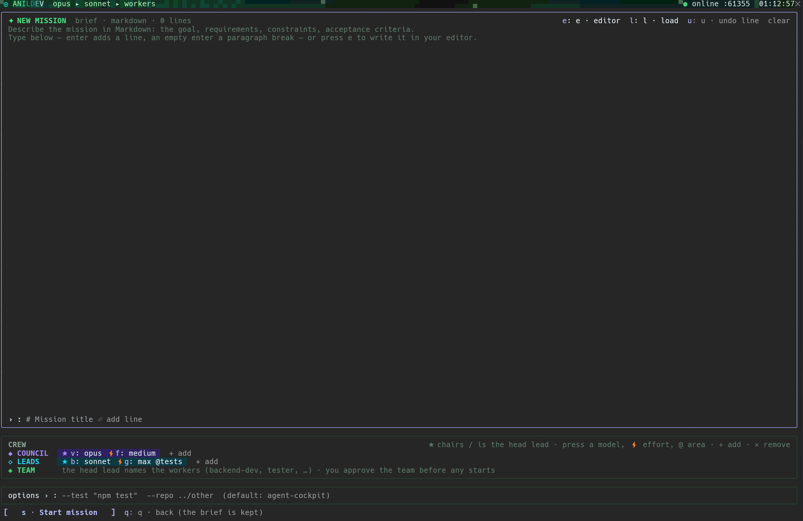
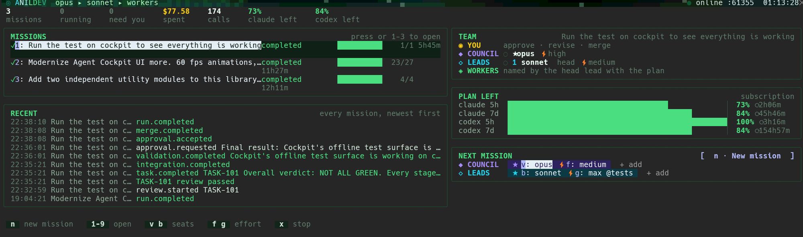
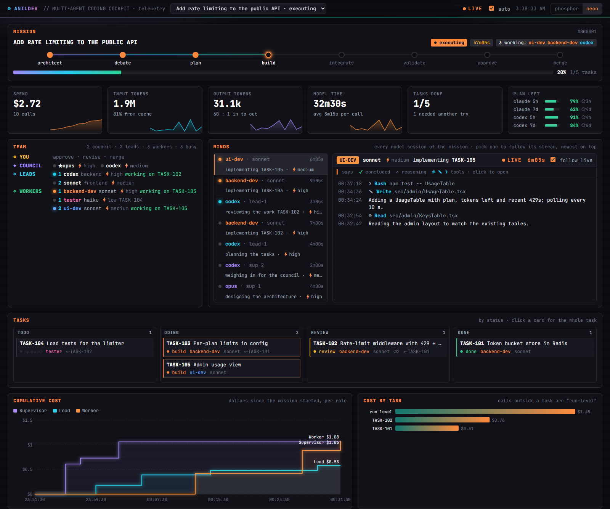

# beautiful-agent-cockpit

**Run a whole engineering team of AI agents from Claude Code — and watch every one of them think.**

You describe a mission. A council of supervisor models designs the architecture, lead models
plan the work and staff a team of named workers (`backend-dev`, `tester`, `ui-dev`, …), and the
workers build it in parallel, each in its own git worktree. Leads review every change, tests gate
every merge, and nothing reaches your branch until you approve it. A live cockpit in your terminal
and a telemetry dashboard in your browser show who is doing what, what each model is reasoning,
what it costs, and how much of your subscription is left.

[](LICENSE)




<sub>The dashboard during a mission (demo data: `node scripts/demo-dashboard.mjs`). The same
palette, team view and log live in the terminal cockpit.</sub>

## Contents

- [Why](#why)
- [How it works](#how-it-works)
- [Requirements](#requirements)
- [Install](#install)
- [Your first mission](#your-first-mission)
- [The cockpit](#the-cockpit)
- [The dashboard](#the-dashboard)
- [Choosing who leads](#choosing-who-leads)
- [Configuration](#configuration)
- [Command line](#command-line)
- [Under the hood](#under-the-hood)
- [Development](#development)
- [Contributing](#contributing)
- [License](#license)

## Why

One agent with a big prompt loses the thread on real work. A team doesn't: an architect who
sets the direction, leads who break it down and hold the bar, specialists who do one job each
in isolation, and a human who signs off. This project runs that team on the CLIs you already pay
for — **no API keys**: it drives your logged-in `claude` and (optionally) `codex`.

- **A real hierarchy, enforced in code.** Workers talk only to their lead; only leads escalate to
  the council; only the council (or a risky operation) reaches you.
- **Parallel and safe.** Every task gets its own worktree and branch, file leases keep tasks from
  colliding, and your working tree is untouched until the final, approved merge.
- **You stay in charge.** You pick the council and the leads per mission, approve (or revise) the
  worker team before anyone starts, and approve the final result.
- **Every model at its own effort.** The same model can chair at `high`, lead at `medium` and test
  at `low` — no shared knobs.
- **Nothing hidden.** Each model narrates what it does; its reasoning (where the model publishes
  it), tool calls and outcomes stream into the cockpit and the dashboard.
- **Frugal by design.** The council rules on proposals once, at the end; hand-offs carry diffs and
  test results rather than whole repositories.
- **Resumable.** All state is in SQLite; restart anything and active missions pick up where they
  were.

## How it works



<sub>Source: `docs/how-it-works.html` (open it in a browser; a 2× screenshot of it is the image above).</sub>

1. **Architecture.** The council's chair designs the approach, constraints and acceptance
   criteria. The other members review it; any objection makes the chair revise once.
2. **Debate.** The head lead challenges the design with evidence from the code; the council rules
   (members give their view first; anything that genuinely needs you is escalated).
3. **Plan and team.** The head lead splits the work into a dependency graph of tasks, assigns each
   to a lead by area, and staffs a team of named workers, each a model at an effort. **The mission
   waits for you to approve the team** — change a worker's model or effort, add or drop one, or send
   the plan back with a note.
4. **Build.** Independent tasks run in parallel in isolated worktrees. A worker that is unsure asks
   its lead; its lead answers or escalates.
5. **Review.** The task's lead reviews the diff against the test result; changes go back to the
   same worker session. A failing test can never be approved.
6. **Integrate and validate.** Approved branches merge into an integration branch, the tests run,
   and the whole council judges the result.
7. **You decide.** Approve (merge), request changes (another round), or reject.

## Requirements

| | |
|---|---|
| **Node.js** | 22.13 or newer (uses the built-in `node:sqlite`) |
| **git** | any recent version |
| **Claude Code** | installed and logged in (`claude`) — a subscription or API account |
| **Codex CLI** | optional, logged in (`codex login`) — to seat Codex models |
| **OS** | Windows, macOS or Linux |

## Install

### From the plugin marketplace (recommended)

Inside Claude Code:

```
/plugin marketplace add anilized/beautiful-agent-cockpit
/plugin install agent-cockpit@beautiful-agent-cockpit
```

Restart Claude Code (or `/reload-plugins`), type `/cockpit`, and press **`i`** once: the cockpit
installs the orchestrator's dependencies (`npm install` in the marketplace's copy of this
repository). Then press **`s`** to start it. `/plugin marketplace update beautiful-agent-cockpit`
pulls new versions.

### From a clone (for development)

```bash
git clone https://github.com/anilized/beautiful-agent-cockpit.git
cd beautiful-agent-cockpit
npm install
claude --plugin-dir ./packages/claude-plugin
```

Either way, `node bin/cockpit.mjs doctor` in the repository checks that `claude`, `codex` and
`git` are found and logged in. (`COCKPIT_ROOT` points the cockpit at another checkout.)

## Your first mission

Inside Claude Code, in the repository you want to work on (it needs at least one commit):

1. Type `/cockpit`. The cockpit opens; press **`s`** to start the orchestrator (**`i`** first, once, after a marketplace install).
2. Press **`n`** for a new mission. Write the brief — line by line, or press **`e`** to write it in
   your editor and **`l`** to load it back. Below it, pick the **council** and the **leads**
   (press a model to change it, ⚡ for its effort, `@` for a lead's area; `+ add` seats another).
   

3. Press **`s`** to start. Watch the architecture form and the debate run.
4. When the plan is ready, **NEEDS YOU** shows the proposed team. Adjust it and press **`a`**.
5. Follow the work: the log, each agent's stream, the code preview, the team. Press **`d`** for the
   dashboard.
6. When the council has validated the result, review the report (**`4`** or **`p`**) and press
   **`a`** to merge, **`c`** to ask for changes, or **`r`** to reject.

Prefer the terminal? The same mission from a shell:

```bash
node bin/cockpit.mjs daemon --detach
node bin/cockpit.mjs run "Add rate limiting to the API" --repo ../api --test "npm test" \
  --council opus:high,codex:medium --leads codex:high@backend,sonnet:medium@frontend --follow
node bin/cockpit.mjs approve <runId>
```

## The cockpit

A dense command center in a Claude Code pane, built after lazygit and agent managers like Claude
Squad: every agent, task and change is on screen at once, in the same place every time.



<sub>Home, between missions. While a mission runs, the cockpit is the grid below.</sub>

```
◎ ANILDEV  // MULTI-AGENT CODING COCKPIT       ⎇ api  ● executing  3 agents  $2.72  ◔ claude 79% · codex 91%
┌ MISSIONS 1/2  m: › 0: ⌂┐┌ API / ADD RATE LIMITING   ⎇ main  #a1b2c3  ● executing ┐┌ TASKS (5)  1 done ──────────┐
│ ● Rate limiting   1/5  ││ ● architect ─ ● debate ─ ● plan ─ ◉ build ─ ○ integrate … ││ ● Per-plan limits  backend-dev│
│ ✓ Audit log       4/4  ││ ▕████████▏ 20%                                            ││ ◉ Middleware 429   backend-dev│
├ AGENTS ─── 3 working ──┤│ 1 Log  2 Task  3 Events  4 Report                         ││ ● Admin usage view ui-dev     │
│ ○ opus · chair         ││ 00:37 [UI-DEV     ] ❯ Bash npm test -- UsageTable          │├ AGENT: UI-DEV ── ● working ──┤
│ ◉ codex · backend lead ││ 00:36 [LEAD       ] ∴ The limiter is mounted before auth…  ││ src/admin/UsageTable.tsx   A │
│ ◉ backend-dev · sonnet ││       continues on the next row, never cut short           ││                              │
│ CREW  ★ opus ⚡high    ││ 00:34 [BACKEND-DEV] ✎ Write config/limits.yaml             ││                              │
├ PLAN LEFT ─────────────┤├ CODE PREVIEW ──────────────┬ TEAM ─────────────────────────┤├ AGENT OUTPUT (ui-dev) ───────┤
│ claude 5h ▕███▏ 79% 3h ││  12   12  router.use(auth)  │ ◉ YOU     approve · merge     ││ 00:36 ▍ Adding a UsageTable… │
│ SPEND $2.72            ││       13 +router.use(limit) │ ◆ COUNCIL ○ ★opus ○ codex     ││                              │
└────────────────────────┘└────────────────────────────┴ ◈ WORKERS ● 1 backend-dev … ──┘└──────────────────────────────┘
 j k move  h l agents/tasks  1-4 view  0 home  │  n new  p report  d dashboard  x stop
```

| Area | What it shows |
|---|---|
| **Home** | Opens when nothing is under way (or `0` from a mission): missions with status and progress (`1`–`9` open one), the latest mission's team, recent milestones, what is left of each subscription, and the next mission's crew. |
| **NEW MISSION** (`n`) | Its own screen: a Markdown brief of any length (`e` editor, `l` load, `u` undo a line), the council and leads, options (`--test`, `--repo`); `s` starts, `q` goes back and keeps the brief. |
| **Header** | Repository, status, working agents, spend, subscription left, clock. |
| **NEEDS YOU** | Only while a decision waits: `a` approve, `c` changes, `r` reject. For a team, each worker with its model and effort, editable in place (`⧉` adds a second one for parallel work, `×` drops one). |
| **AGENTS · CREW** | Every council seat, lead and worker by name, `running` / `thinking` / `idle`; earlier sessions to read back; the live crew, editable. |
| **Centre** | The mission's lifecycle and progress, then `1` **Log** (every agent and the orchestrator, newest on top; long thoughts wrap whole), `2` **Task** (the whole task, its review and its last test run), `3` **Events**, `4` **Report**. |
| **TASKS · AGENT** | Each task with its worker and pipeline stage; the followed agent's state and changed files. |
| **CODE PREVIEW** | The biggest change of the task in focus, with line numbers. |
| **TEAM** | The hierarchy in tiers — YOU, COUNCIL, LEADS, WORKERS — each worker numbered by the lead that owns it. |
| **AGENT OUTPUT** | The followed agent's own stream (▸ opens a tool call or an outcome whole). |
| **PLAN LEFT · SPEND** | What is left of each Claude / Codex window and when it resets; the mission's cost per agent. |

**Keys:** `j`/`k` move in the focused list, `h`/`l` switch between agents and tasks, `1`–`4` pick
the centre view, `o` folds finished tasks, `m` next mission, `0` home, `n` new mission, `p` report,
`d` dashboard, `t` retry a failed mission, `s`/`x` start/stop the orchestrator. Rows that are cut
short open with a click.

**Look:** phosphor green by default; `COCKPIT_THEME=neon` for violet / cyan / orange.
`COCKPIT_BRAND` sets the name in the header (default `ANILDEV`). The cockpit animates at up to
60 fps while a mission runs, idles at 1 fps, and freezes with `COCKPIT_REDUCED_MOTION=1`. From 130
columns it is the grid above; narrower, two columns, then one.

**Slash commands:**

| Command | |
|---|---|
| `/cockpit` | open the cockpit pane |
| `/cockpit start` · `stop` | start / stop the orchestrator |
| `/cockpit run <request> [--test "<cmd>"] [--repo <path> …]` | start a mission from the prompt |
| `/cockpit approve [note]` · `changes <text>` · `reject [note]` | decide the pending approval |
| `/cockpit report` · `status` · `dashboard` | the report · a text status · the dashboard link |

## The dashboard

`d` in the cockpit (or `node bin/cockpit.mjs dashboard`) opens a page the orchestrator serves on
`127.0.0.1`, in the cockpit's look:

- the mission, its lifecycle and progress; spend, tokens, cache rate, model time;
- **plan left** — every subscription window and when it resets;
- the **team** in tiers, live;
- **Minds** — every model session; follow one to read its narration, reasoning, tool calls and
  outcomes as they happen;
- the task board, cumulative cost per role, cost per task, input tokens per call, a span timeline,
  a sortable calls table and a searchable event log.



The page switches between phosphor and neon with one click. Its data needs a read-only token that
the link carries in its fragment (never sent to a server or logged), and that token allows GETs
only. To work on the page without a daemon: `node scripts/demo-dashboard.mjs`.

## Choosing who leads

- **The council** — one or more supervisors; the first (★) chairs and has the final say. Members
  review the architecture, give their view before the chair rules on proposals, and judge the
  result; one member's "revise" sends the work back. A council of one costs nothing extra.
- **The leads** — the first (★) is the head lead: it reviews the architecture, plans and
  integrates. Each task names the lead that owns it (by area); that lead answers its worker and
  reviews its work.
- **The team** — named by the head lead with the plan (`backend-dev`, `tester`, `db-engineer`, …),
  each a worker model at an effort. You approve it before any worker starts
  (`team.approval: false` in `cockpit.yaml` skips that). A later round asks again only
  for new or changed workers.
- **Efforts are never shared.** Every seat and every worker carries its own level.
- **Mid-mission** (a limit ran out, a model misbehaves): edit the CREW in the cockpit, or
  `cockpit seats <runId> --council opus,sonnet --leads codex:high`. Calls already running finish
  where they are.
- **Who may sit where** is the `roles` list of each agent in `config/agents.yaml`
  (`cockpit agents` prints it). Unset, a mission takes `hierarchy` from that file.

## Configuration

Everything lives in `config/` and is safe to change without touching code.

| File | What it holds |
|---|---|
| `agents.yaml` | The agents (adapter, model, roles, default effort, specialties, capacity) and the default seating. Add a worker by adding an entry. |
| `cockpit.yaml` | Engine settings: parallelism, review rounds, decision rounds, timeouts, team approval, final merge (`merge` or leave a `branch`), telemetry export (local JSONL, optional OTLP). |
| `routing.yaml` | How tasks are routed to workers when the plan names none: per specialty, risk and complexity. |
| `permissions.yaml` | High-risk command classifiers (destructive shell, pushes, migrations, secrets, cloud…) that require your approval, and the workers' tool allow / deny lists. |

Environment: `COCKPIT_DATA_DIR` (default `~/.agent-cockpit`: database, worktrees, traces,
snapshot), `COCKPIT_THEME`, `COCKPIT_BRAND`, `COCKPIT_EDITOR` (for mission briefs, default `code`),
`COCKPIT_REDUCED_MOTION`, `COCKPIT_CODEX_BIN`.

**Subscription limits** come from Claude Code itself (the session the cockpit runs in, and every
Claude call the orchestrator makes) and from Codex's own session logs (`~/.codex/sessions`).

## Command line

```
cockpit doctor                                  check claude / codex / git and logins
cockpit daemon [--detach] · stop                start / stop the orchestrator
cockpit run "<request>" | --file brief.md  --repo <path> [--test "<cmd>"] [--base <branch>] [--repo …]
            [--council <agent>[:<effort>],…] [--leads <agent>[:<effort>][@<area>],…] [--follow]
cockpit status [<runId>] [--json] · approvals · report <runId> · events [<runId>] [--follow]
cockpit approve <runId|approvalId> [note] · changes <runId> "<what>" · reject <runId|approvalId> [note]
cockpit seats <runId> [--council …] [--leads …]   re-seat a live mission
cockpit team <runId> '<json>'                     revise a mission's worker team
cockpit retry <runId>                             re-enter a failed mission where it failed
cockpit agents · dashboard [<runId>]
```

(`cockpit` is `node bin/cockpit.mjs`; `npm link` puts it on your PATH.)

## Under the hood

### Mission lifecycle

```
created → architecting (chair; council reviews) → proposing (head lead challenges with evidence)
        ⇄ deciding (council rules: accept / amend / reject / request analysis / escalate to you)
        → planning (head lead: task graph, owning leads, the team) → awaiting your team approval
        → executing (parallel, conflict-aware, leased, isolated)
        → integrating (merge queue per repo + integration tests; conflicts → lead, else back to the worker)
        → validating (council) → awaiting your approval
        → merging → completed          | changes → planning (round + 1) | reject → rejected
```

### Task lifecycle

```
pending → ready → running ─► needs_input ─► (its lead answers; may escalate to the council) ─► running
                    │
                    ▼ commit in worktree
               validating (leases re-checked on the real diff; test command run)
                    │                          └► lease_conflict ─► lead: wait / transfer / serialize / escalate
                    ▼
               in_review (its lead, read-only) ─► changes_requested ─► running (same worker session resumed)
                    │                                  └ after N rounds ─► escalated ─► council ─► (you)
                    ▼
               approved ─► integrated
```

### Guarantees enforced by the orchestrator, not by model judgement

- Every implementation task gets its own worktree and branch (`agent/<run>/<TASK>-<slug>`) under
  `<dataDir>/worktrees`; your working tree is untouched until the approved final merge.
- Predicted scope is leased before a task starts; the actual diff is re-leased at submission.
- A code task cannot be approved while its tests fail, or without adequate tests — even if the
  reviewer approves. Failing integration tests are never presented as accepted.
- The final merge happens only after your approval; a dirty or diverged base branch blocks it and
  asks again.
- High-risk commands are classified by `permissions.yaml` and require approval.
- The review → retry loop is bounded (`review.maxIterations`, default 3), then escalates
  worker → lead → council → you.

### Keeping tokens down

- **The council rules at the end, not per task:** proposals raised in task reviews are deferred to
  final validation and ruled on there in one call (`decisions.duringTasks: defer`).
- **Narrow hand-offs:** leads review from the diff and the test result (diffs past 60k characters
  are cut and opened on demand); the council validates from the report.
- **Parallel by default:** tasks that name the same package but disjoint files run side by side
  (`maxParallelTasks`, default 4).

### Persistence, events and telemetry

SQLite (`<dataDir>/cockpit.db`) holds projects, repositories, runs, tasks, dependencies, agents,
sessions (with provider session ids for resume), worktrees, leases, reviews, proposals, decisions,
approvals, events and usage. Every state change is a structured event, persisted in order and
streamed over SSE (`GET /events`). OpenTelemetry spans cover every phase, agent call, test,
integration and approval wait; they go to `<dataDir>/traces/*.jsonl` and, with
`telemetry.otlpEndpoint`, to any OTLP backend (Tempo, Jaeger…).

### Adapters

`AgentAdapter` has Claude, Codex and Fake implementations; roles bind to profiles in
`agents.yaml`, never to model names. Verified against the installed CLIs:

- **Claude Code 2.1.x** — `claude -p --output-format stream-json --json-schema …`, `--session-id` /
  `--resume`; read-only roles run with read-only tools, workers with `acceptEdits` and the
  allow / deny lists from `permissions.yaml`.
- **Codex CLI 0.15x–0.16x** — `codex exec --json --output-schema …`, `-c sandbox_mode=…`,
  `codex exec resume <thread>`. Found on PATH (npm `.cmd` shims resolve to `node <script>` on
  Windows) or in the desktop app; override with `COCKPIT_CODEX_BIN`.
- Headless agents cannot ask mid-turn, so a worker ends its turn with `needs_input`; the
  orchestrator routes the question to its lead and resumes the worker's session with the answer.
- The Claude Code plugin runtime has no Node or network access; the cockpit renders a snapshot the
  orchestrator writes and acts through the CLI.

### Repository layout

```
packages/
  core/          domain model, events, state machines, task + conflict graphs, agent contracts, config schemas
  persistence/   SQLite store (node:sqlite) — the authoritative workflow state
  telemetry/     OpenTelemetry tracer; local JSONL export, optional OTLP
  workspace/     process layer, git worktrees, file / module / resource leases
  agents/        adapters (Claude, Codex, Fake), router, role prompts
  transport/     127.0.0.1 HTTP + SSE with a per-daemon token (and a read-only one for the dashboard)
  orchestrator/  engine, task pipeline, council, scheduler, service, CLI, dashboard
  claude-plugin/ the cockpit: pane, /cockpit command, raster painters, blit scheduler, theme
config/          agents.yaml · cockpit.yaml · routing.yaml · permissions.yaml
scripts/         adapter smoke test, dashboard demo
```

## Development

```bash
npm run typecheck
npm test                                     # unit + end-to-end (fake agents, real git worktrees)
node --import tsx scripts/smoke-adapters.ts  # exercises the real claude / codex CLIs
node scripts/demo-dashboard.mjs              # the dashboard with demo data, no daemon

cd packages/claude-plugin
npm run check                                # palette, typecheck, pane tests (claude plugin test)
npm run bench                                # painter cost per frame (budget: mean < 4 ms)
```

The pane tests render the cockpit against recorded snapshots at 60, 100 and 140 columns and fail
on any row wider than the pane or split across lines. What still needs a live terminal (frame
rate, input latency, CPU) is listed in `packages/claude-plugin/GATE0.md`.

## Contributing

Issues and pull requests are welcome. Before opening a PR, run `npm run typecheck`, `npm test`
and `npm run check` in `packages/claude-plugin`. Colours live only in
`packages/claude-plugin/hooks/theme.ts` (the palette check enforces it); keep the dashboard's
palettes in step with it. For UI changes, a screenshot of the cockpit or the dashboard helps.

## License

[MIT](LICENSE) © 2026 anilized
